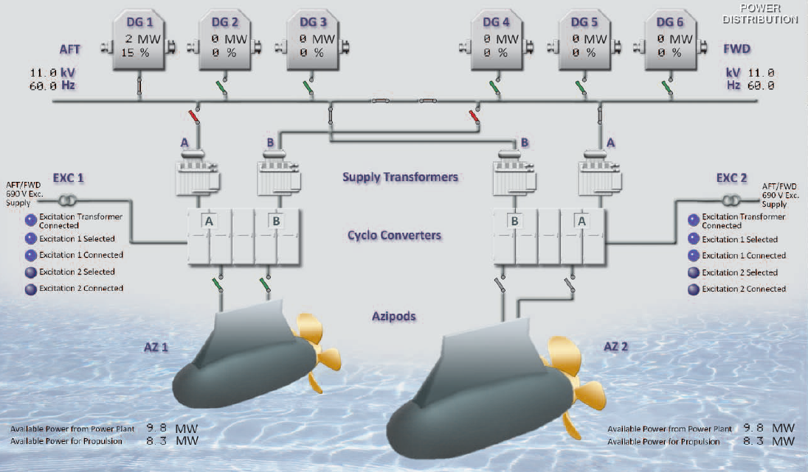

# The main purpose of that question - describe all tabs and maybe a vessel partially #

## Model A **TANKER** ##

1.  Describe and demonstrate main simulator components and their designation. Models: A, B or C.
-------------------------

**Tanker is a special type of vessel for carrying liquids, especially mineral oils in bulk.**
This is an Afromax tanker (LCC MAN B&W 6S60MC-C). It's length about two hundred and fifty meters, Average speed is about fifteen knots. This tanker uses diesel engine for propulsion.

Model A consists of a bottom tabs where we can navigate through different places onboard the tanker:

- For example we can go to the bridge and look at the bridge control console (**BCC**). Where the deck department can control the vessel by different control elements like steering wheel.
- Then we can see Engiene Control Room (**ECR**) where we can monitor and control the most of ER mechanisms like main engine.
- **MSB** - Main electrical Switchboard. By this tab we can switch for example on the Main Circuit Diagram(MCD) and get detailed information about the current state of the electrical station. Also we can find local group starter panels with according Circuit Breakers this may be helpful for example when we are looking for insulation breakdown.
- **CMS** - Control and Monitoring System - This tab allows us to check current alarms, e.g. insulation resistance condition of Marine Growth Protection System alarms. It's very important system which allow monitoring of overall vessel condition
- **BMCS** - Boiler Monitoring & Control system. It's integrated Personal Computer based system for remote supervision of the ship's aux boiler and related systems. We can control motors of boiler's system, such as feed water pump, circulation pump from that tab if these motors are in remote control mode.
- **Diag** - This tab modeling Cylinder Indicator Diagrams of the main propulsion and Diesel engines of the generators and combustion process. Indicator Diagram looks like:

it describes relationship

$$
\frac{Angle \quad of \quad rotation \quad of \quad the \quad crankshaft}
{Pressure \quad in \quad cylinder}
$$

- **SYS** - Describes the main systems of tankers like fresh water system, sea water system, fuel oil, air compressed systems and so on. From that tab we can control different valves.
- **SG** - Steering Gear room page. We can check our motors, in that model RAM-type steering gear used with axial-reciprocating pumps where we can change the pressure of oil by incline built-in pump plate. So we can change the position of piston and incline of rudder blade.
- **ER1...ER4** This is decks of engine room, where ER1 is the bottom deck where we can find our oil water separator control panel for turning gear and another machines, it's very convinient
- **FFR** - Fire Fighting Room - it's a room where we can different shut-off valves control panels and foam system
- **EmG** - Emergency Generator Room. In that room we can find our Emergency switchboard (MSBD) and our emergency diesel-generator control panel and shore connection panel.
- **CCR** - Cargo control room for control cargo equipment

### [Main abbreviations that maybe helpful for TANKER](./abbreviations/tanker_abbreviations.md) ###

### [Tanker Firefighting video](https://www.youtube.com/watch?v=vs2tbcEfeyE)
### [Tanker TroubleShooting video](https://www.youtube.com/watch?v=62zhb7z_1Ww)
### [Tanker Default Video. DOCK](https://youtu.be/nkz5eX2ZtO8)
### [Tanker Vetting Video ](https://youtu.be/HJbkmnCj6qQ)

## Model B **DUAL-FUEL-LNG** ##

This is a protoype of LNG tanker "Velikiy Novgorod" It's length about three hundred meters, serivce speed is about twenty knots. It uses electrical motors for propulsion and dual-fuel main generators.

Navbar:

As we can see there are small diffrences for example:
- **IAS** - Integrated Automation System. The main difference between CMS, that we can control our mechanisms from that station but many CMS already have that property. 

- **BT** - Bow Thruster room. Bow Thruster is used for more comfortable maneuvering. Bow thruster can be very helpful in mooring operations.

The rest of the tabs are the same as on the tanker.

On this type of vessel we use electrical energy for propulsion we can find it on the tab 
**MCB/MCD** :

MG - Main generators provide electrical energy for supply our PM ( Propulsion Motors ). These Main Generators use the gas that leak from our gas tanks. But we can't achieve stable working by means only gas, we also use pilot fuel diesel oil to get more smooth operation. For better understanding we can use fuel system:

 ### [ Abbreviations that maybe helpful for DUAL-FUEL-LNG  ](./abbreviations/dual_fuel_abbreviations.md) ###

### [LNG repair circuit breaker video](https://youtu.be/gzY0J_s53Js)
### [LNG Prepare for propulsion video](https://youtu.be/qFQXpVJAslA)

## Model С **AZIPOD CRUISE** ##

Total Electricall power fifty two thousands kilowatts. Tonnage is abot eighty two thousands tonns. Length is two hundred ninty one meters. Approximate speed is twenty four knots. This vessel uses electromotors (Azipods) for propulsion. 

A new tabs:

- **CID** - Cylinder Indicator Diagrams - is used in place of **Diag** 
- **ACS** - Air Conditionig system for accommodation heating, ventialation and air conditioning capable of meeting the required conditions for passengers, officers, crew cabins, offices, public rooms, technical spaces
- **AMS** - Alarm and monitoring system - is used for the same purposes as **IAS** and **CMS**

### AZIPOD - is an electrical moter that overboard in a special case, looks like: ###

### Power distribution system is following: ###

Every propulsion module can be supplied as from forpeak main switchbord so and from afterpeak switchboard. Cyclo Converters is used for transform the frequency of electrical energy for controll Rotations Per Minute (RPMs) of propulsion motors. This motors are needed for excitations that is lower then main supply voltage (only six hundred volts) So there are excitation transformers (EXC 1 and EXC 2)
 
 ### [ Abbreviations that maybe helpful for AZIPOD  ](./abbreviations/azipod_abbreviations.md) ###

### [AZIPOD Prepare for propulsion video](https://youtu.be/knJQXcWfj0Y)

