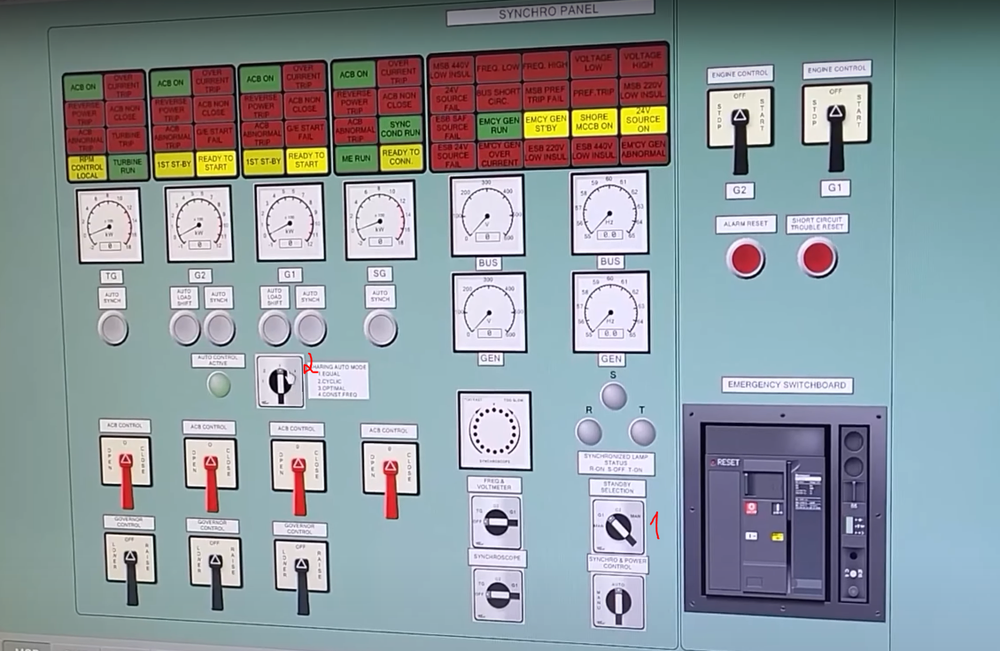

# Generator Panels

## TANKER

### Default simulation start condition is shore power supply but steps the same for all simulations.

For starting the engine we need to provide in enough pressure of fuel. Enough pressure is created by the diesel oil generator engine pumps (DO GE pumps). This model of tanker has two such pumps.  One is electrical the second is pneumatic. We can see that on the tab Fuel Oil Service Main Engine and Generator Engine system:

 - SYS → FO ME GE Service System

1 - Electric pump ; 2- Pneumatic pump; 3-manual pneumatic valve

We need to open the pneumatic valve 3.

Then we need make some settings on Synchro panel:

- MSB → Synchro Panel

We need to choose standby generator with help of selector switch "STANDBY SELECTION", let it be the first generator. Also with the help of selector switch number two we choose OPTIONAL load-sharing mode.

Now we can disconnect from shore:

- EmG → ESB Generator & Shore Panels

On this tab we can turn off CB of SHORE CONNECTION BOX:

Now we can see that the diesel-engine #1 automatically starts and the circuit breaker of generator was closed automatically.

Then we need to start the second engine, back to Synchro panel to do some preferences:
- MSB → Synchro Panel
    - press Alarm Reset
    - switch Standby Selectrion → manual
    - switch Synchronoscope → G2
    - switch FREQ&Voltmeter → G2
    - switch SYNCRO/POWER → AUTO (if you are going to synchronize automatically)

Then we can go to the local control panel of diesel engine:

- ER3 → GE 1-2 LOP
  - set two-positional selector switch of starting generator in local mode;
  - press the button START;
  - return two-positional selector switch in the remote state;
  - wait for 900 rpm on tachometer.

### Then we can do automatic synchronisation.
- MSB → Synchro Panel
  - press G2 → AUTO SYNCH

### Or you can be asked for manual operation then:
- MSB → Synchro Panel
  - switch SYNCRO/POWER → MANUAL;
  - with help of handles GOVERNOR CONTROL decrease phase shift between generators (use both handles for stable frequncy)
  - when phase shift will be at 12 hours close the ACB of generator with help of ACB CONTROL switch

Then you can be asked to start electrical diesel oil pump and turn off pneumatic you can also do it in the:
 - SYS → FO ME GE Service System
   - click on the upper motor and start it from menu
   - close the bottom valve

### Disconnection
- MSB → Synchro Panel
  - switch SYNCRO/POWER → MANUAL;
  - decrease the load of disconnecting generator less then 10% of nominal power (use both handles)
  - open the Circuit Breaker with help of handle CONTROL CB of disconnecting generator

